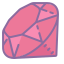

### Hi there 👋

My name is **Lucas Grünheidt**, but most of my friends call me **grun**. I work as a **Ruby on Rails** back-end **developer** [@autoseg](https://www.autoseg.com).

Currently I live in **Brazil** :brazil: and I'm finishing my bachelor degree in Systems Analysis and Development at [Fatec São Paulo](https://en.wikipedia.org/wiki/S%C3%A3o_Paulo_State_Technological_College)

I have a dual citzenship (:de: / :brazil:) and I plan on moving to Germany for a Masters program (after 2021)

### Things I work with :factory:
    

### Things that help me work :trolleybus:

    

### Things I'm learning :thought_balloon:

 

### My GitHub stats :game_die:

### Languages I speak
:us:
:brazil:
:de:

### You're visitor number:

